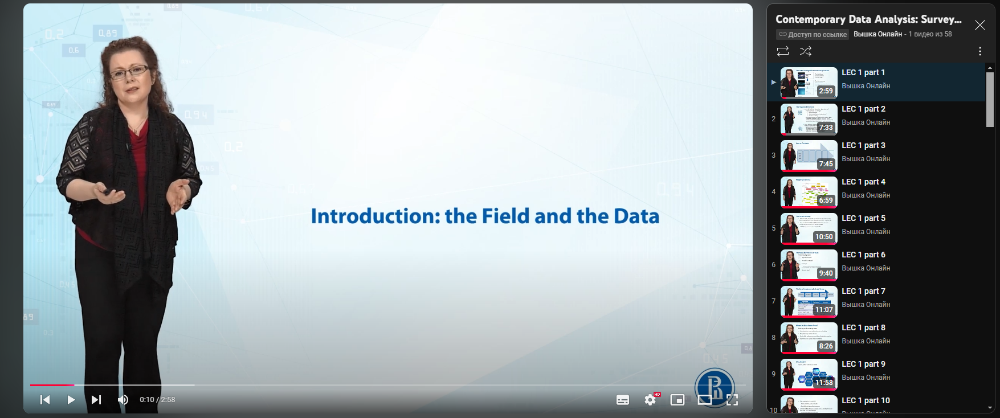

# download_yt
Bare in mind that this project requires python with version >3.* already installed 
### Packages Installation <a name="installing_packages"></a>

First of all update pip
```shell
python3 -m pip3 install --upgrade pip
```

Now we can install packages from requirements.txt file
```shell
pip3 install -r requirements.txt
```

Packages list can be found in requierments.txt file

### Project setup <a name="setup"></a>

1. Choose option either convert mp4 to mp3 files and delete mp4, or just download mp4 files
2. Choose the folder and open the config.py file 
3. Change the folder_path inside the folder_path variable
4. Change the link inside the playlist_url variable(pay attention to the link if the playlist won't open with this link the script won't work)

The link should open web-page with the playlist like this:


### Start the script <a name="start"></a>
```shell
python3 main.py
```
Or start it within your IDE.